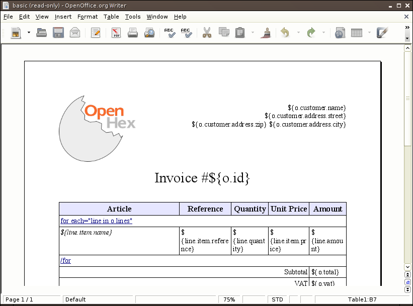
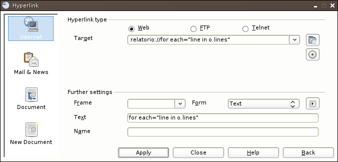
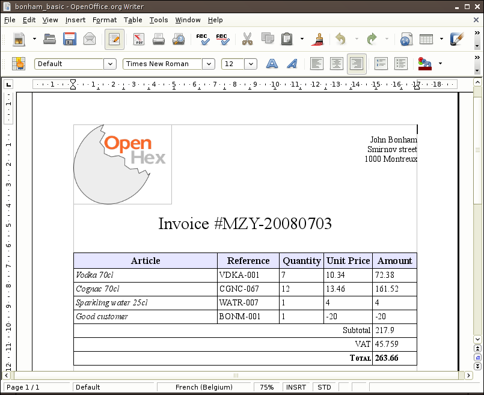
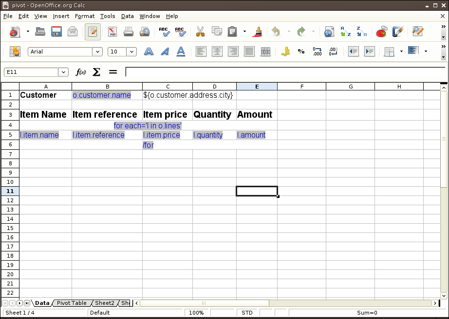
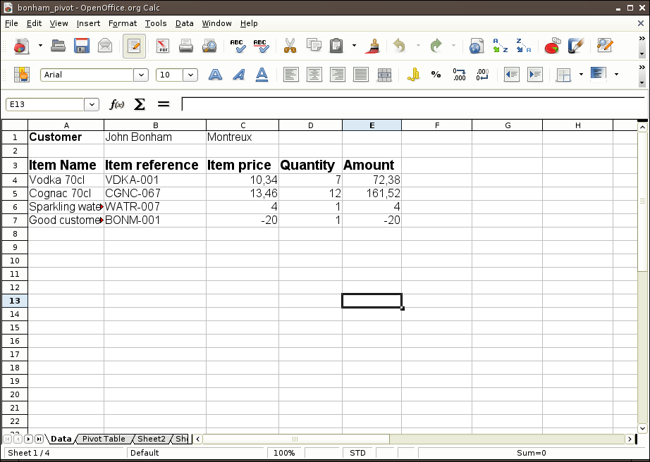
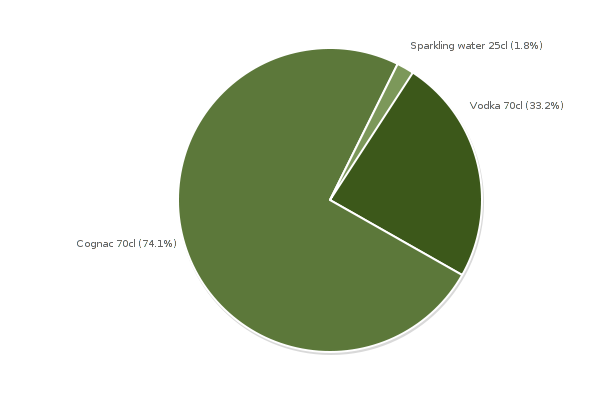
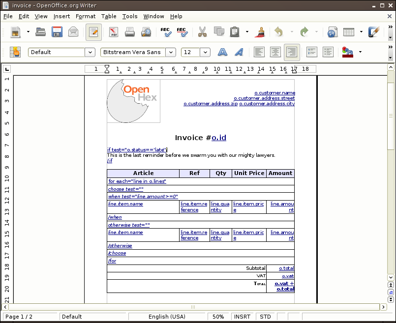
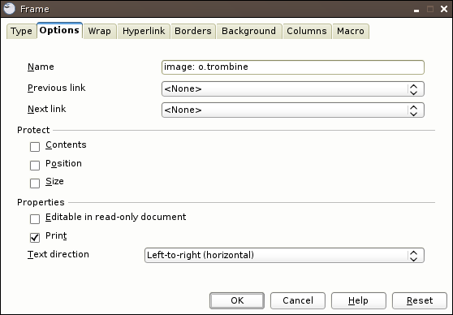
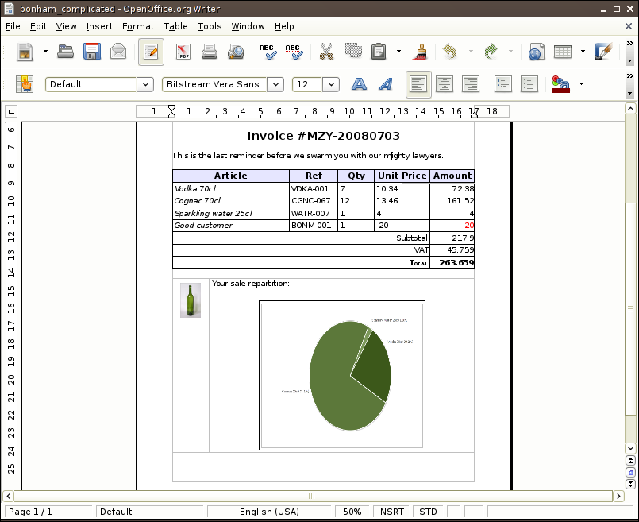

Indepth Example
===============

In this page I will detail the way I created the reports that can be found in
the `examples directory`_.

.. _examples directory: http://hg.tryton.org/relatorio/file/tip/examples

Let's start with the content of :file:`common.py`, this file stores the
definition of an invoice that will be used to create the different reports. The
invoice is a simple python dictionary with some methods added for the sake of
simplicity:

.. include:: ../examples/common.py
    :literal:

Create a simple OpenOffice Writer template
------------------------------------------

Let's start with the simple template defined in :file:`basic.odt`.

This report will be created and rendered with the following three line of code::

    from relatorio.templates.opendocument import Template
    basic = Template(source=None, filepath='basic.odt')
    file('bonham_basic.odt', 'wb').write(basic.generate(o=inv).render().getvalue())

Notice that the dictionary passed to `generate` is used to bind names to make
them accessible to the report. So you can access the data of the invoice with a
Text Placeholder_ containing `o.customer.name`. This is where you can see our
Genshi_ heritage. In fact, all reports using relatorio are subclasses of
Genshi's Template. Thus you can use most of the goodies provided by Genshi.

.. _Placeholder: http://wiki.services.openoffice.org/wiki/Documentation/OOoAuthors_User_Manual/Writer_Guide/Using_placeholder_fields
.. _Genshi: http://genshi.edgewall.org/

To iterate over a list you must use an hyperlink (created through
'Insert > Hyperlink') and encode as the target the Genshi expression to use.
The URL-scheme used *must* be `relatorio`. You can use whatever text you want
as the link text, but we find it way more explicit to display the Genshi code
used. Here is the example of the for loop.

And thus here is our invoice, generated through relatorio:

One step further: OpenOffice Calc and OpenOffice Impress templates
------------------------------------------------------------------

Just like we defined a Writer template it is just as easy to define a
Calc/Impress template. Let's take a look at :file:`pivot.ods`.

As usual you can see here the different way to make a reference to the content
of the invoice object:

    * through the Text Placeholder interpolation of Genshi
    * or through the hyperlink specification I explained earlier.

Note that there is another tab in this Calc file used to make some data
aggregation thanks to the `data pilot`_ possibilities of OpenOffice.

.. _data pilot: http://www.learnopenoffice.org/CalcTutorial33.htm

And so here is our rendered template:

Note that the type of data is correctly set even though we did not have
anything to do.

Everybody loves charts
----------------------

Now we would like to make our basic report a bit more colorful, so let's add a
little chart. We are using PyCha_ to generate them from our :file:`pie_chart`
template:

.. include:: ../examples/pie_chart
    :literal:

.. _PyCha: http://www.lorenzogil.com/projects/pycha/

Once again we are using the same syntax as Genshi but this time this is a
TextTemplate_. This file follow the YAML_ format thus we can render it into a
data structure that will be sent to PyCha:

    * the options dictionary will be sent to PyCha as-is
    * the dataset in the chart dictionary is sent to PyCha through its
      `.addDataset` method.

.. _TextTemplate: http://genshi.edgewall.org/wiki/Documentation/text-templates.html
.. _YAML: http://www.yaml.org/

If you need more information about those go to the `pycha website`_.

.. _pycha website: http://www.lorenzogil.com/projects/pycha/

And here is the result:

A (not-so) real example
-----------------------

Now that we have everything to start working on our complicated template
:file:`invoice.odt`, we will go through it one step at a time.

In this example, you can see that not only the openoffice plugin supports the
`for directive`, it also supports the `if directive` and the `choose directive`
that way you can choose to render or not some elements.

The next step is to add images programmatically, all you need to do is to
create frame ('Insert > Frame') and name it `image: expression` just like in
the following example:

The expression when evaluated must return a couple whose first element is a
file object containing the image and second element is its mimetype. Note that
if the first element of the couple is an instance of `relatorio report`_ then
this report is rendered (using the same arguments as the originating template)
and used as a the source for the file definition.

.. _relatorio report: http://hg.tryton.org/relatorio/file/tip/relatorio/reporting#l108

This kind of setup gives us a nice report like that:

