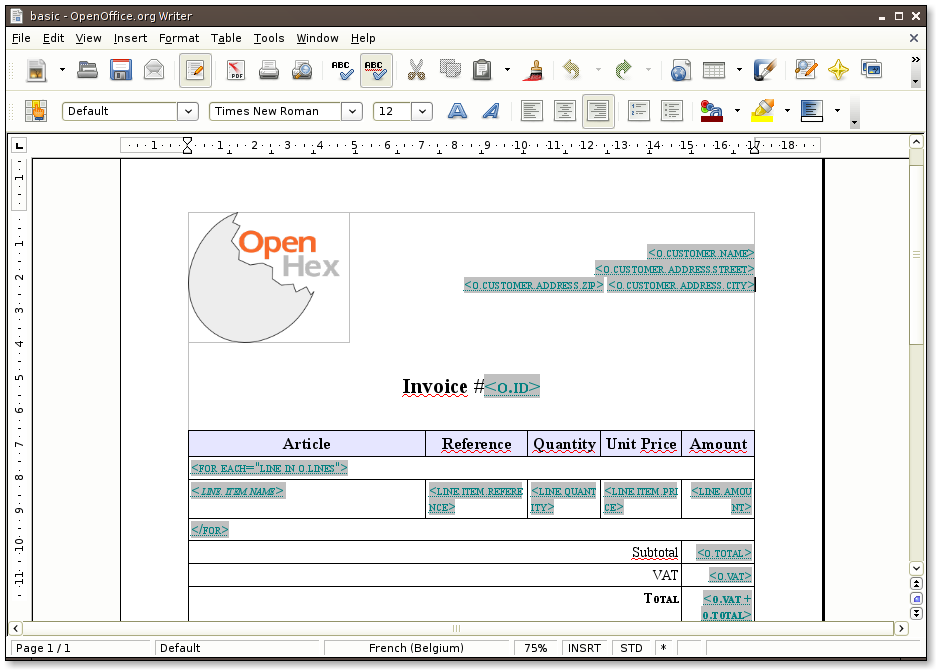
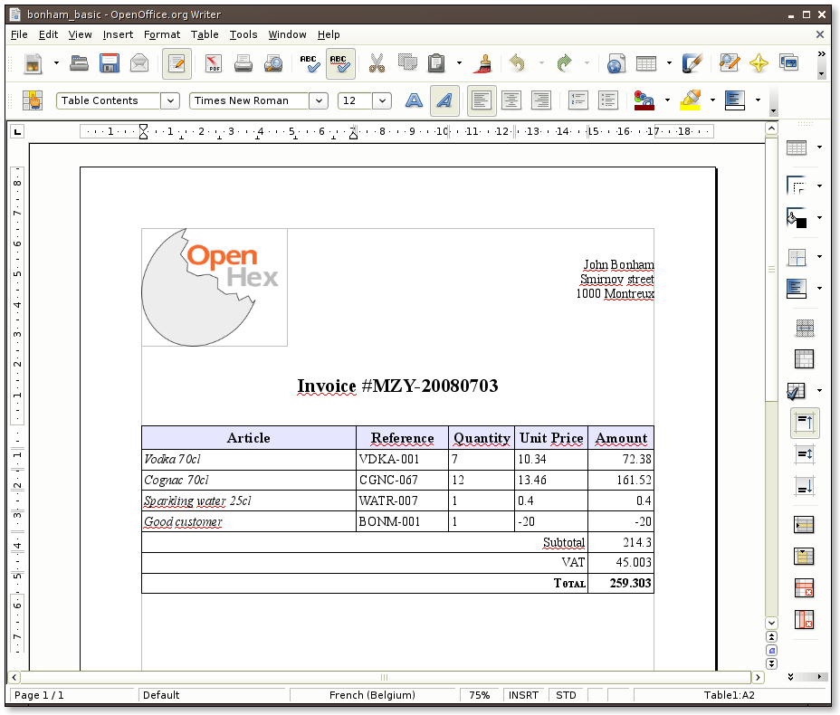

Quick Example
=============

In this page we will show you how you can create OpenOffice documents using Relatorio.

Data
-----

We need some data objects to work on, so let's first create a fake invoice
object. Please create a file named :file:`data.py` in your favorite text
editor, and copy the following content:

.. include:: ../examples/common.py
    :literal:

So we created the data for an invoice for the famous Led Zeppelin's drummer and
his favorite addiction.

Template
--------

The next thing to do is to create a template for invoices. We will use the one
displayed below. To create the Genshi directives, you need to create a
text-type placeholder field, and fill it with the expression you want to use.

Generate the final documents
----------------------------

Now that we have both a template and some data, we can now start to use
Relatorio to create John Bonham's particular invoice. So fire up your favorite
python interpreter (we suggest using IPython_) and type (or copy-paste) the
following commands::

    from relatorio.templates.opendocument import Template
    from data import bonham_invoice
    basic = Template(source=None, filepath='basic.odt')
    basic_generated = basic.generate(o=bonham_invoice).render()
    file('bonham_basic.odt', 'wb').write(basic_generated.getvalue())

.. _IPython: http://ipython.scipy.org/

On the first line we import the opendocument Template engine. This class has
the same signature as the one from Genshi but uses only the filepath argument.
On the fourth line, we generate the final document from the template and the
data. Note how we pass `o=bonham_invoice` as argument to generate. This is the
same "o" variable as was used in the O dt template we just created. render()
returns us a StringIO object, which is then used to pipe the result to a file.

And so here is our invoice with all the fields completed according to the
Invoice object we created earlier. Notice how the style we set in the template
are also applied in the resulting invoice.

In this example, we only used the `py:for` directive, but Relatorio also
supports other Genshi directives: `py:if`, `py:choose` / `py:when` /
`py:otherwise` and `py:with`.
